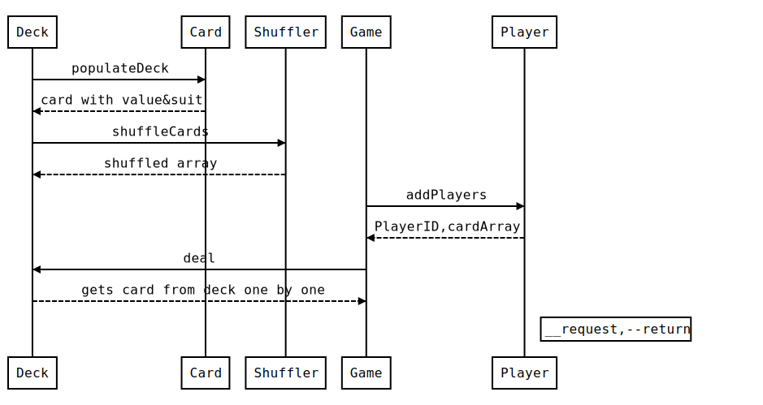

# Kurt Geiger tech test

The scenario is as follows:

You have a deck of 52 cards, comprised of 4 suits (hearts, clubs, spades and diamonds) each with 13 values (Ace, two, three, four, five, six, seven, eight, nine, ten, jack, queen and king).

There are four players waiting to play around a table.

The deck arrives in perfect sequence (so, ace of hearts is at the bottom, two of hearts is next, etc. all the way up to king of diamonds on the top).

The task is a simple one. Please create a simple command line program that when executed recreates the scenario above and then performs the following two actions:

Shuffle the cards - We would like to take the deck that is in sequence and shuffle it so that no two cards are still in sequence.

Deal the cards - We would then like to deal seven cards to each player (one card to the each player, then a second card to each player, and so on)

There is no need to necessarily do this in a visual way (for example, simply proving with a test that your deck is shuffled and that the players do now have seven cards will be sufficient)

## User Stories

```
As a User
So that I can play a game of cards
I would like to have a deck of cards

As a User
So that I can play properly
I would like to have 4 suits each with 13 values

As a User
So that I can start a fresh game
I would like all cards to be in perfect sequence

As a User
So that I can make the game interesting
I would like to shuffle the cards

As a User
So that I can play fair game
I would like to see no two cards are still in sequence

As a User
So that I can start playing
I would like to deal seven cards to each player
```

## Approach

* First I went through the instructions quite a lot of times and broke them into small user stories.
* My approach was to take one user story at a time so that I take small steps which will make it easier to implement the task.
* As I was new to PHP I read PHP documentation to understand how PHP works.
* Next was to decide what classes I need, so extracted verbs and nouns from user stories and made a rough sequence diagram to understand the flow of information between classes, encapsulate similar behaviors and not to assign more than one responsibility to one class.

## Data flow Diagram



## Reasoning

* I made a Card class so that it can be reused to add different types of cards.
* I have declared value and suit array as instance variables which will give the flexibility of adding or removing any value from the array later.
* I made a Shuffler class so that I can add different rules to shuffle in future, currently it is just a normal shuffle.
* Making a separate Shuffler class will make testing of shuffle method easy.
* Used loop to test the number of cards in players hand as it will provide flexibility to testing if in future game is played between less than or more than 4 players.

## How to run Tests

* `./vendor/bin/phpunit tests --coverage-text --whitelist src/` to run the test with coverage(need to `install php-xdebug` for coverage).

```
Code Coverage Report:  
                         
 Summary:                
  Classes: 80.00% (4/5)  
  Methods: 95.00% (19/20)
  Lines:   95.00% (38/40)

Card
  Methods: 100.00% ( 3/ 3)   Lines: 100.00% (  5/  5)
Deck
  Methods: 100.00% ( 7/ 7)   Lines: 100.00% ( 13/ 13)
Game
  Methods:  83.33% ( 5/ 6)   Lines:  87.50% ( 14/ 16)
Player
  Methods: 100.00% ( 3/ 3)   Lines: 100.00% (  5/  5)
Shuffler
  Methods: 100.00% ( 1/ 1)   Lines: 100.00% (  1/  1)
```

## How to use

* `composer install ` to download the dependency
* `php -a` for PHP interactive mode:
    * require_once './src/Game.php';
    * $game = new Game();
    * $game->shuffleCards()
    * $game->deal();
    *  print_r($game->getPlayers());

``` 

Array
(
    [0] => Player Object
        (
            [playerID:Player:private] => 
            [cards:Player:private] => Array
                (
                    [0] => Card Object
                        (
                            [value:Card:private] => 8
                            [suit:Card:private] => ♣
                        )

                    [1] => Card Object
                        (
                            [value:Card:private] => 4
                            [suit:Card:private] => ♣
                        )

                    [2] => Card Object
                        (
                            [value:Card:private] => 8
                            [suit:Card:private] => ♠
                        )

                    [3] => Card Object
                        (
                            [value:Card:private] => 5
                            [suit:Card:private] => ♠
                        )

                    [4] => Card Object
                        (
                            [value:Card:private] => 9
                            [suit:Card:private] => ♣
                        )

                    [5] => Card Object
                        (
                            [value:Card:private] => J
                            [suit:Card:private] => ♠
                        )

                    [6] => Card Object
                        (
                            [value:Card:private] => 3
                            [suit:Card:private] => ♠
                        )

                )

            [1] => 1
        )

    [1] => Player Object
        (
            [playerID:Player:private] => 
            [cards:Player:private] => Array
                (
                    [0] => Card Object
                        (
                            [value:Card:private] => 10
                            [suit:Card:private] => ♥
                        )

                    [1] => Card Object
                        (
                            [value:Card:private] => 3
                            [suit:Card:private] => ♥
                        )

                    [2] => Card Object
                        (
                            [value:Card:private] => 9
                            [suit:Card:private] => ♥
                        )

                    [3] => Card Object
                        (
                            [value:Card:private] => 5
                            [suit:Card:private] => ♣
                        )

                    [4] => Card Object
                        (
                            [value:Card:private] => 10
                            [suit:Card:private] => ♠
                        )

                    [5] => Card Object
                        (
                            [value:Card:private] => 2
                            [suit:Card:private] => ♥
                        )

                    [6] => Card Object
                        (
                            [value:Card:private] => A
                            [suit:Card:private] => ♠
                        )

                )

            [2] => 2
        )

    [2] => Player Object
        (
            [playerID:Player:private] => 
            [cards:Player:private] => Array
                (
                    [0] => Card Object
                        (
                            [value:Card:private] => 6
                            [suit:Card:private] => ♠
                        )

                    [1] => Card Object
                        (
                            [value:Card:private] => 9
                            [suit:Card:private] => ◆
                        )

                    [2] => Card Object
                        (
                            [value:Card:private] => A
                            [suit:Card:private] => ♥
                        )

                    [3] => Card Object
                        (
                            [value:Card:private] => 7
                            [suit:Card:private] => ♥
                        )

                    [4] => Card Object
                        (
                            [value:Card:private] => 2
                            [suit:Card:private] => ♣
                        )

                    [5] => Card Object
                        (
                            [value:Card:private] => A
                            [suit:Card:private] => ◆
                        )

                    [6] => Card Object
                        (
                            [value:Card:private] => 7
                            [suit:Card:private] => ♣
                        )

                )

            [3] => 3
        )

    [3] => Player Object
        (
            [playerID:Player:private] => 
            [cards:Player:private] => Array
                (
                    [0] => Card Object
                        (
                            [value:Card:private] => 6
                            [suit:Card:private] => ♥
                        )

                    [1] => Card Object
                        (
                            [value:Card:private] => 10
                            [suit:Card:private] => ◆
                        )

                    [2] => Card Object
                        (
                            [value:Card:private] => 5
                            [suit:Card:private] => ◆
                        )

                    [3] => Card Object
                        (
                            [value:Card:private] => A
                            [suit:Card:private] => ♣
                        )

                    [4] => Card Object
                        (
                            [value:Card:private] => 5
                            [suit:Card:private] => ♥
                        )

                    [5] => Card Object
                        (
                            [value:Card:private] => Q
                            [suit:Card:private] => ◆
                        )

                    [6] => Card Object
                        (
                            [value:Card:private] => 6
                            [suit:Card:private] => ♣
                        )

                )

            [4] => 4
        )

)


```

* require_once './src/Deck.php';
* $deck = new Deck;
* print_r($deck->getDeck());

``` 

Array
(
    [0] => Card Object
        (
            [value:Card:private] => A
            [suit:Card:private] => ♥
        )

    [1] => Card Object
        (
            [value:Card:private] => 2
            [suit:Card:private] => ♥
        )

    [2] => Card Object
        (
            [value:Card:private] => 3
            [suit:Card:private] => ♥
        )

    [3] => Card Object
        (
            [value:Card:private] => 4
            [suit:Card:private] => ♥
        )

    [4] => Card Object
        (
            [value:Card:private] => 5
            [suit:Card:private] => ♥
        )

    [5] => Card Object
        (
            [value:Card:private] => 6
            [suit:Card:private] => ♥
        )

    [6] => Card Object
        (
            [value:Card:private] => 7
            [suit:Card:private] => ♥
        )

    [7] => Card Object
        (
            [value:Card:private] => 8
            [suit:Card:private] => ♥
        )

    [8] => Card Object
        (
            [value:Card:private] => 9
            [suit:Card:private] => ♥
        )

    [9] => Card Object
        (
            [value:Card:private] => 10
            [suit:Card:private] => ♥
        )

    [10] => Card Object
        (
            [value:Card:private] => J
            [suit:Card:private] => ♥
        )

    [11] => Card Object
        (
            [value:Card:private] => Q
            [suit:Card:private] => ♥
        )

    [12] => Card Object
        (
            [value:Card:private] => K
            [suit:Card:private] => ♥
        )

    [13] => Card Object
        (
            [value:Card:private] => A
            [suit:Card:private] => ♣
        )

    [14] => Card Object
        (
            [value:Card:private] => 2
            [suit:Card:private] => ♣
        )

    [15] => Card Object
        (
            [value:Card:private] => 3
            [suit:Card:private] => ♣
        )

    [16] => Card Object
        (
            [value:Card:private] => 4
            [suit:Card:private] => ♣
        )

    [17] => Card Object
        (
            [value:Card:private] => 5
            [suit:Card:private] => ♣
        )

    [18] => Card Object
        (
            [value:Card:private] => 6
            [suit:Card:private] => ♣
        )

    [19] => Card Object
        (
            [value:Card:private] => 7
            [suit:Card:private] => ♣
        )

    [20] => Card Object
        (
            [value:Card:private] => 8
            [suit:Card:private] => ♣
        )

    [21] => Card Object
        (
            [value:Card:private] => 9
            [suit:Card:private] => ♣
        )

    [22] => Card Object
        (
            [value:Card:private] => 10
            [suit:Card:private] => ♣
        )

    [23] => Card Object
        (
            [value:Card:private] => J
            [suit:Card:private] => ♣
        )

    [24] => Card Object
        (
            [value:Card:private] => Q
            [suit:Card:private] => ♣
        )

    [25] => Card Object
        (
            [value:Card:private] => K
            [suit:Card:private] => ♣
        )

    [26] => Card Object
        (
            [value:Card:private] => A
            [suit:Card:private] => ♠
        )

    [27] => Card Object
        (
            [value:Card:private] => 2
            [suit:Card:private] => ♠
        )

    [28] => Card Object
        (
            [value:Card:private] => 3
            [suit:Card:private] => ♠
        )

    [29] => Card Object
        (
            [value:Card:private] => 4
            [suit:Card:private] => ♠
        )

    [30] => Card Object
        (
            [value:Card:private] => 5
            [suit:Card:private] => ♠
        )

    [31] => Card Object
        (
            [value:Card:private] => 6
            [suit:Card:private] => ♠
        )

    [32] => Card Object
        (
            [value:Card:private] => 7
            [suit:Card:private] => ♠
        )

    [33] => Card Object
        (
            [value:Card:private] => 8
            [suit:Card:private] => ♠
        )

    [34] => Card Object
        (
            [value:Card:private] => 9
            [suit:Card:private] => ♠
        )

    [35] => Card Object
        (
            [value:Card:private] => 10
            [suit:Card:private] => ♠
        )

    [36] => Card Object
        (
            [value:Card:private] => J
            [suit:Card:private] => ♠
        )

    [37] => Card Object
        (
            [value:Card:private] => Q
            [suit:Card:private] => ♠
        )

    [38] => Card Object
        (
            [value:Card:private] => K
            [suit:Card:private] => ♠
        )

    [39] => Card Object
        (
            [value:Card:private] => A
            [suit:Card:private] => ◆
        )

    [40] => Card Object
        (
            [value:Card:private] => 2
            [suit:Card:private] => ◆
        )

    [41] => Card Object
        (
            [value:Card:private] => 3
            [suit:Card:private] => ◆
        )

    [42] => Card Object
        (
            [value:Card:private] => 4
            [suit:Card:private] => ◆
        )

    [43] => Card Object
        (
            [value:Card:private] => 5
            [suit:Card:private] => ◆
        )

    [44] => Card Object
        (
            [value:Card:private] => 6
            [suit:Card:private] => ◆
        )

    [45] => Card Object
        (
            [value:Card:private] => 7
            [suit:Card:private] => ◆
        )

    [46] => Card Object
        (
            [value:Card:private] => 8
            [suit:Card:private] => ◆
        )

    [47] => Card Object
        (
            [value:Card:private] => 9
            [suit:Card:private] => ◆
        )

    [48] => Card Object
        (
            [value:Card:private] => 10
            [suit:Card:private] => ◆
        )

    [49] => Card Object
        (
            [value:Card:private] => J
            [suit:Card:private] => ◆
        )

    [50] => Card Object
        (
            [value:Card:private] => Q
            [suit:Card:private] => ◆
        )

    [51] => Card Object
        (
            [value:Card:private] => K
            [suit:Card:private] => ◆
        )

)


```


## Areas for development

* If I had more time I would have looked into mocking the output of shuffle method so that my test doesn't fail when shuffle method has not actually shuffled the array.
* Improve the shuffle method.